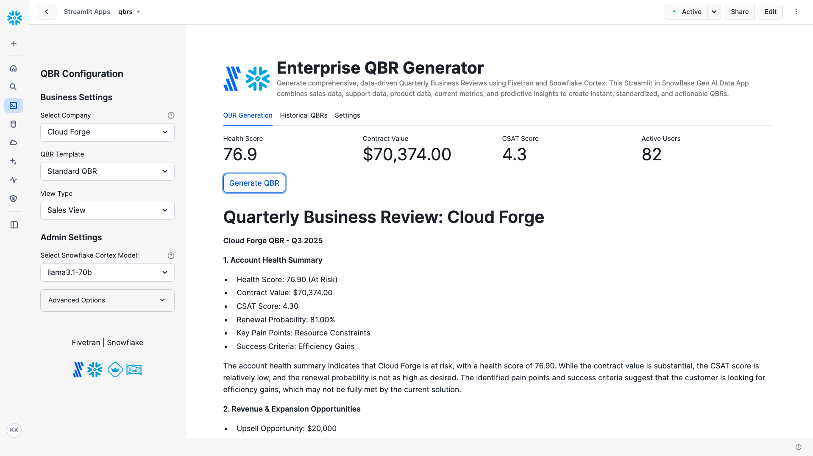

# Enterprise QBR Generator

A Fivetran and Cortex-powered Streamlit in Snowflake data application for generating comprehensive Quarterly Business Reviews.

## Overview

The Enterprise QBR Generator is an AI-powered application that helps customer success teams, account managers, and executives create comprehensive, data-driven Quarterly Business Reviews in minutes instead of days. This Streamlit in Snowflake data application combines sales data, support metrics, product usage, and historical context to generate standardized, insightful, and actionable QBRs tailored to various business needs.

The application utilizes a synthetic QBR dataset that simulates real customer account data. This synthetic data is moved into Snowflake using a custom connector built with the Fivetran Connector SDK, enabling reliable and efficient data pipelines for enterprise QBR generation.

## Data Sources

The application is designed to work with data from multiple enterprise systems:

### Enterprise Data Sources (Simulated)
- **CRM Systems**: 
  - Salesforce
  - HubSpot
  - Microsoft Dynamics
- **Support Ticketing Systems**: 
  - Zendesk
  - ServiceNow
  - Freshdesk
- **Product Analytics Platforms**: 
  - Amplitude
  - Mixpanel
  - Pendo

For demonstration and development purposes, we've created a synthetic dataset that approximates these data sources and combined them into a single `QBR_RECORDS` table exposed through an API server. This approach allows for realistic QBR generation without using confidential customer information.

## Key Features

- **AI-powered QBR content generation**: Leverages Snowflake Cortex to analyze customer data and generate comprehensive QBR reports
- **Multiple QBR templates**: Choose from Standard QBR, Executive Summary Only, Technical Deep Dive, or Customer Success Focus
- **Customizable view types**: Adapt the QBR to different audiences with Sales View, Executive View, Technical View, or Customer Success View
- **Historical QBR tracking**: Access previously generated QBRs for reference and comparison
- **Data explorer**: Browse and filter underlying QBR data
- **Custom Fivetran connector**: Utilizes a custom connector built with the Fivetran Connector SDK to reliably move data from source systems to Snowflake

## Streamlit Data App Sections

### QBR Generation
- **Company selection**: Choose the specific customer account for your QBR
- **Template selection**: Select the appropriate QBR template format
- **View type selection**: Customize the QBR focus based on the intended audience
- **Key metrics dashboard**: View at-a-glance metrics including Health Score, Contract Value, CSAT Score, and Active Users
- **One-click generation**: Create comprehensive QBRs with a single button click
- **Download option**: Save generated QBRs as Markdown files

### Historical QBRs
- **Access and review**: View previously generated QBRs
- **Chronological sorting**: Latest QBRs appear at the top for easy access
- **Expandable entries**: Click to expand full QBR content

### Settings
- **Snowflake configuration**: View current database and schema settings
- **Data explorer**: Browse and search the QBR_RECORDS table
- **Column selection**: Customize which data columns to display
- **Filtering options**: Filter data by industry, company size, deal stage, and more
- **Pagination controls**: Navigate through large data sets with ease

## Setup Instructions

1. Within Snowflake, click on **Projects**
2. Click on **Streamlit**
3. Click the blue box in the upper right to create a new Streamlit application
4. On the next page:
   - Name your application
   - **IMPORTANT:** Set the database context
   - **IMPORTANT:** Set the schema context

### Fivetran Data Movement Setup

1. Ensure the API server hosting the synthetic QBR data is operational
2. Configure the custom Fivetran connector (built with Fivetran Connector SDK) to connect to the API server - debug and deploy
3. Start the Fivetran sync in the Fivetran UI to move data into a `QBR_RECORDS` table in your Snowflake instance
4. Verify data is being loaded correctly by checking the table in Snowflake

## Data Flow

1. **Synthetic Data Creation**: A synthetic dataset approximating real QBR data sources has been created and exposed via an API server, representing data from CRM, support, and product analytics systems

2. **Custom Data Integration**: A custom connector built with the Fivetran Connector SDK communicates with the API server to extract the synthetic QBR data

3. **Automated Data Movement**: Fivetran manages the orchestration and scheduling of data movement from the API server into Snowflake

4. **Data Loading**: The synthetic QBR data is loaded into Snowflake as a `QBR_RECORDS` table in a structured format ready for analysis

5. **Data Analysis and Generation**: Snowflake Cortex analyzes the data and generates comprehensive QBR content

6. **Data Visualization**: Streamlit in Snowflake presents the QBR data and generation interface in an interactive data application

## Data Requirements

The application expects a table named `QBR_RECORDS` which contains synthetic data simulating various QBR metrics. This data is retrieved from an API server using a custom Fivetran connector built with the Fivetran Connector SDK:

### Company Information
- `COMPANY_NAME`
- `COMPANY_ID`
- `INDUSTRY`
- `SIZE`
- `QBR_QUARTER`
- `QBR_YEAR`

### Deal Information
- `DEAL_STAGE`
- `CONTRACT_VALUE`
- `CONTRACT_START_DATE`
- `CONTRACT_EXPIRATION_DATE`
- `UPSELL_OPPORTUNITY`
- `ESTIMATED_ROI_VALUE`
- `ROI_CALCULATED`

### Account Health Metrics
- `HEALTH_SCORE`
- `CSAT_SCORE`
- `ACTIVE_USERS`
- `FEATURE_ADOPTION_RATE`
- `RENEWAL_PROBABILITY`

### Support Metrics
- `TICKET_VOLUME`
- `AVG_RESOLUTION_TIME_HOURS`
- `SLA_COMPLIANCE_RATE`

### Success Planning
- `PAIN_POINTS_DOCUMENTED`
- `SUCCESS_CRITERIA_DEFINED`
- `SUCCESS_METRICS_DEFINED`
- `NEXT_STEPS_DEFINED`

### Account Engagement
- `CHAMPION_IDENTIFIED`
- `CHAMPION_LEVEL`
- `CHAMPION_ENGAGEMENT_SCORE`
- `ECONOMIC_BUYER_IDENTIFIED`
- `EXECUTIVE_SPONSOR_ENGAGED`
- `DECISION_MAKER_LEVEL`

### Additional Fields
- `DECISION_TIMELINE_CLEAR`
- `DECISION_PROCESS_DOCUMENTED`
- `URGENCY_LEVEL`
- `PAIN_IMPACT_LEVEL`
- `COMPETITIVE_SITUATION`
- `COMPETITIVE_POSITION`
- `CUSTOM_INTEGRATIONS`
- `PENDING_FEATURE_REQUESTS`
- `TECHNICAL_CRITERIA_MET`
- `BUSINESS_CRITERIA_MET`

## Technical Details

This application uses:
- Streamlit in Snowflake for the user interface
- Snowflake Cortex for AI-powered QBR generation
- Multiple AI models including Llama 3.1/3.3, Claude, Mistral, and more
- Snowpark for Python for data processing
- **Fivetran Connector SDK** for building a custom connector to retrieve synthetic QBR data from an API server
- **Custom Fivetran connector** for automated, reliable data movement into Snowflake

## Benefits

- Save hours of manual QBR preparation time
- Create consistent, standardized QBRs across all accounts
- Customize content for different stakeholders and audiences
- Ensure all key metrics and insights are included
- Maintain a historical record of all QBRs
- Scale QBR production across large numbers of accounts

## Available Models

The application supports multiple Snowflake Cortex models, including:
- llama3.1-70b
- claude-3-5-sonnet
- snowflake-llama-3.1-405b
- mistral-large2
- And many others